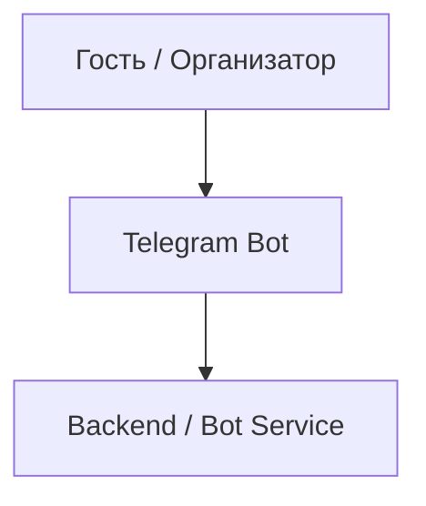

# Архитектурная схема

## Пояснение

- **Telegram Bot** — интерфейс для организатора и гостя.
- **Backend / Bot Service** — основная бизнес-логика: OAuth, генерация слотов, бронирование и отмена.
- **PostgreSQL** — хранение пользователей, правил доступности, токенов и бронирований.
- **Google Calendar API** — проверка занятости календаря, создание и отмена событий.
- **Notification Layer** — отправка подтверждений и уведомлений через Telegram.
- **Транзакции и уникальные ограничения** — защита от двойного бронирования.
